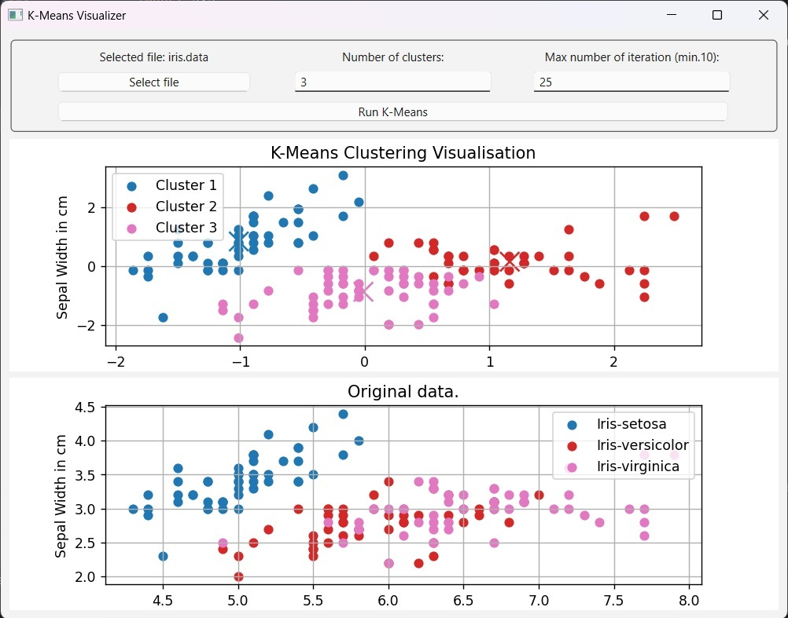

# K-Means alogrithm

## Table of Contents
* [General Info](#general-information)
* [Technologies Used](#technologies-used)
* [Features](#features)
* [Screenshots](#screenshots)
* [Setup](#setup)


## General Information
- A simple implementation of the K-Means algorithm for data clustering.

## Technologies Used
- Python 3.12
- Pandas 2.2.3
- Numpy 2.2.1
- Matplotlib 3.10.0
- PySide6 6.8.1.1


## Features
- Clustering visualization
- Graphic User Interface


## Screenshots



## Setup

To run this project, install it locally using pip:
```
$ cd ../K_means
$ pip install numpy
$ pip install pandas
$ pip install PySide6
```
